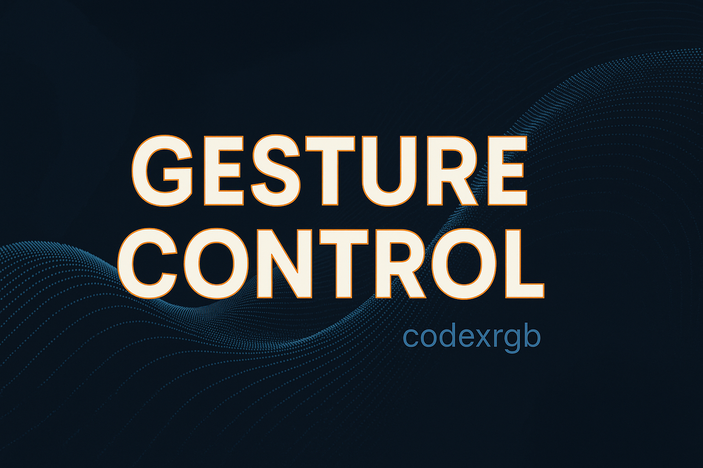

## 🎥 Demo GIF

  

  

<h1 align="center">GestureControl 🤖🖐</h1>

  Control your laptop with **hand gestures** using AI-powered hand tracking (MediaPipe + OpenCV).
   
  <strong>Volume • Brightness • Media Control • Scrolling</strong>

  
  
  
  

---

## 🚀 Overview

GestureControl transforms your webcam into a **gesture-driven controller** using AI-based hand tracking.  
It allows seamless **volume**, **brightness**, **media playback**, and **scrolling** control — all without touching the keyboard.

Built using:

- 🧠 **MediaPipe Hands** (21-point hand landmarks)  
- 👁️ **OpenCV** (real-time video processing)  
- 🖱 **PyAutoGUI** (system interactions)  
- 🔊 **Linux tools** (`playerctl`, `brightnessctl`, `pactl`)

---

## ✨ Features

### 🎚 Volume Control
- 🤏 Pinch (thumb + index finger)
- Distance between fingers controls volume from **0 to 100%**

### 💡 Brightness Control
- 🖐 Move your open palm **up** to increase brightness  
- 🖐 Move your open palm **down** to decrease brightness  

### 🎵 Media Controls
- ✊ Fist → Play/Pause  
- 👉 Swipe Right → Next Track  
- 👈 Swipe Left → Previous Track  

### 🖱 Scrolling
- Move your hand **closer** → Scroll Up  
- Move hand **away** → Scroll Down  

---

## ✋ Gesture Icons

Below are icons representing each gesture used in the project:

| Gesture | Icon | Meaning |
|--------|------|---------|
| Fist | ✊ | Play / Pause |
| Swipe Right | 👉 | Next Track |
| Swipe Left | 👈 | Previous Track |
| Pinch | 🤏 | Volume Control |
| Palm Up | ✋⬆️ | Increase Brightness |
| Palm Down | ✋⬇️ | Decrease Brightness |
| Palm Forward | ✋➡️ | Scroll Down |
| Palm Backward | ✋⬅️ | Scroll Up |

---

## 📁 Folder Structure

